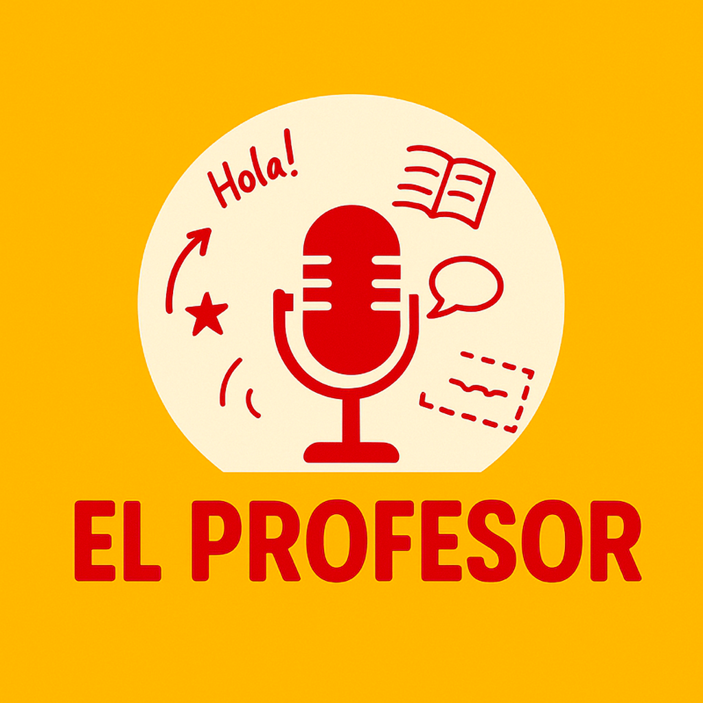

# El Profesor

**Your free, private AI language coach. Runs entirely on your Mac.**

Practice spoken English or Spanish with a real-time AI tutor — no API key, no subscription, no data leaving your machine. Ever.

[](https://apple.com)
[](https://python.org)
[](https://ollama.ai)
[](LICENSE)

---

## Why El Profesor?

Most language apps are either expensive, gamified time-wasters, or send your voice to a cloud server. El Profesor is different:

- **100% free.** No hidden costs, no freemium walls. Forever.
- **100% private.** Your conversations never leave your Mac. No accounts, no telemetry, no logs.
- **Speaks back.** Natural voice synthesis — not robotic text-to-speech. You talk, it talks back.
- **Adapts to you.** 5 teaching styles, 6 CEFR levels (A1 → C2), 12 conversation topics, multiple AI coaches to pick from.
- **No fluff.** Just you and your coach, talking.

> *"The Professor never shows his face. But his students always succeed."* — La Casa de Papel

---

## What it looks like

| Voice conversation | Settings |
|---|---|
| Real-time transcription + AI response | Teacher style, level, topic, coach |

> *(Screenshots coming soon)*

---

## Features

**Languages**
- English 🇬🇧🇺🇸 — British (Angela) or American (Georges) accent
- Spanish 🇪🇸 — Aitanita or Javier

**Teaching styles**
| Style | Description |
|---|---|
| 😊 Bienveillant | Warm, encouraging, gentle corrections |
| 🤙 Natif | Native speaker energy, slang included |
| 🎓 Académique | Formal, grammar-focused |
| 📐 Strict | Corrects every mistake, no mercy |
| 🤔 Socratique | Guides with questions, makes you think |

**CEFR Levels** — A1 through C2

**Conversation topics** — Free talk, job interviews, travel, debates, business negotiation, and more

**Input modes**
- VAD (voice activity detection) — just speak, it listens automatically
- Push-to-talk — hold Space to record

**Profiles & stats** — Multiple learner profiles, session history, progress tracking

---

## Tech Stack

Everything runs locally on your machine.

| Role | Technology | Details |
|---|---|---|
| **UI** | PyQt6 | Native macOS app, dark theme |
| **Speech Recognition** | Whisper (OpenAI, via HuggingFace) | ~500 MB, downloaded on first launch |
| **Language Model** | Llama 3.1 8B via Ollama | ~4.7 GB, runs smoothly on M1/M2/M3 |
| **Voice Synthesis** | Kokoro TTS | High-quality neural voices |
| **Audio I/O** | PortAudio + sounddevice | Low-latency microphone capture |
| **Conversation DB** | SQLite | All data in `~/.langcoach/` |

No cloud. No GPU required. Runs entirely on Apple Silicon Neural Engine + CPU.

---

## Requirements

- Mac with **Apple Silicon** (M1, M2, M3 or later)
- macOS 12 Monterey or later
- ~8 GB free disk space (models + dependencies)
- ~8 GB RAM (16 GB recommended for comfortable use)

---

## Installation

One command. That's it.

```bash
curl -fsSL https://raw.githubusercontent.com/YOUR-USERNAME/YOUR-REPO/main/install.sh | bash
```

The script will:
1. Check your Mac is Apple Silicon
2. Install Homebrew if needed
3. Install PortAudio and Ollama via Homebrew
4. Clone this repo to `~/Applications/ElProfesor/`
5. Create a Python virtual environment and install all dependencies
6. Download Llama 3.1 8B (~4.7 GB — grab a coffee)
7. Create **El Profesor.app** in your `/Applications/` folder

When it's done, find it in your **Launchpad** and double-click.

> **First launch:** Whisper (~500 MB) downloads automatically in the background. Expect 1-2 minutes before the first session is ready.

---

## Updates

El Profesor checks for updates automatically. When a new version is available, a notification appears in Settings — click **Mettre à jour** and it handles the rest.

---

## Architecture

```
MacOS/
├── install.sh              # One-command installer
├── update.sh               # Incremental updater (called by the app)
├── version.txt             # Current version
├── assets/
│   └── LangCoach.icns      # App icon
└── langcoach/
    ├── main.py             # Entry point
    ├── config/
    │   ├── settings.py     # All tuneable constants
    │   └── theme.py        # Visual theme
    ├── core/
    │   ├── session.py      # Main orchestrator
    │   ├── stt.py          # Speech-to-Text (Whisper)
    │   ├── llm.py          # LLM engine (Ollama)
    │   ├── tts.py          # Text-to-Speech (Kokoro)
    │   ├── prompt_builder.py
    │   ├── updater.py      # GitHub Releases update check
    │   └── database.py     # SQLite session storage
    └── ui/
        ├── main_window.py
        ├── settings_panel.py
        ├── dashboard_panel.py
        └── profile_screen.py
```

---

## Keyboard Shortcuts

| Key | Action |
|---|---|
| `Space` (hold) | Push-to-talk |
| `A` | Toggle VAD (auto-listen) |
| `R` | Reset session |
| `S` | Open/close settings |
| `Esc` | Stop voice playback |
| `Enter` | Send typed message |

---

## Privacy

El Profesor collects nothing. There is no server, no account, no analytics.

Your voice is processed locally by Whisper. Your conversation is processed locally by Llama. Your progress data lives in `~/.langcoach/` on your own disk. That's it.

---

## License

MIT — do whatever you want with it.

---

## Credits

Built with [Ollama](https://ollama.ai), [Whisper](https://github.com/openai/whisper), [Kokoro TTS](https://github.com/hexgrad/kokoro), and [PyQt6](https://riverbankcomputing.com/software/pyqt/).

*Inspired by the greatest teacher who never showed his face.*
